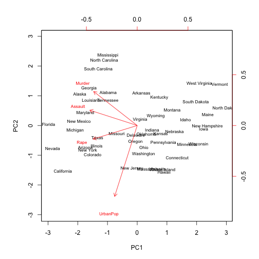
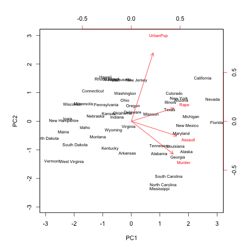
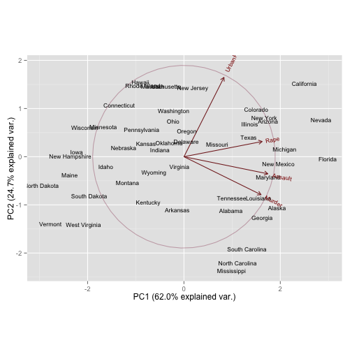
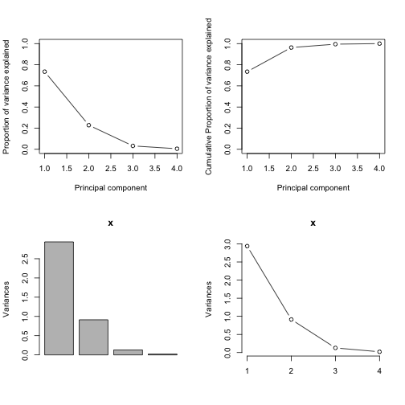
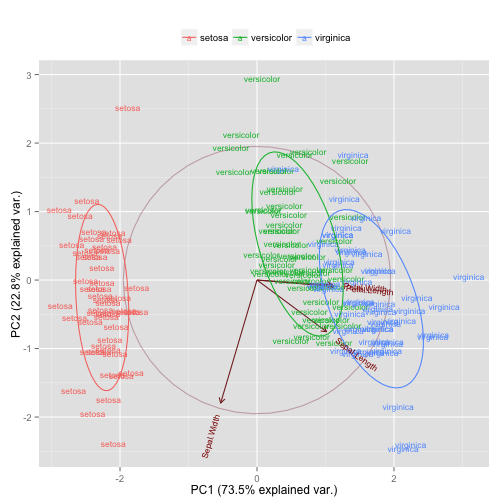

# Principal Component Analysis (PCA)
In this document, we are going to see how to analyse multivariate data set using principal component analysis, in short PCA. I am not going to explain match behind PCA, instead, how to achieve it using R. Intention of the tutorial is, taking 2 datasets, USArrests & iris, apply PCA on them. In fact, both data sets do not have lot of variables to demonstrate dimension reduction in grand way. Still those data sets are good enough to understand how PCA works.
<p>
Before jump into PCA logic in R, I am going to define a common function which is required to display all PCA related plots in 2X2 grid. 


```r
pcaCharts <- function(x) {
    x.var <- x$sdev ^ 2
    x.pvar <- x.var/sum(x.var)
    print("proportions of variance:")
    print(x.pvar)
    
    par(mfrow=c(2,2))
    plot(x.pvar,xlab="Principal component", ylab="Proportion of variance explained", ylim=c(0,1), type='b')
    plot(cumsum(x.pvar),xlab="Principal component", ylab="Cumulative Proportion of variance explained", ylim=c(0,1), type='b')
    screeplot(x)
    screeplot(x,type="l")
    par(mfrow=c(1,1))
}
```


### Analyzing USArrests dataset

It is mandatory that data should be scaled and centered. Centering and scaling can be applied first before calling PCA R functions or PCA function (prcomp) itself has center and scale parameter. In this excercise, we are going to use prcomp parameter for preprocessing.
<p>
_italic_
centering:
Scaling
_italic_

USArrests data sets comes with basic dataset with 4 variables. Using PCA, we are going to find linear combinations of the variables that maxmimal variance and mutually uncorrelated.


```r
head(USArrests)
```

```
##            Murder Assault UrbanPop Rape
## Alabama      13.2     236       58 21.2
## Alaska       10.0     263       48 44.5
## Arizona       8.1     294       80 31.0
## Arkansas      8.8     190       50 19.5
## California    9.0     276       91 40.6
## Colorado      7.9     204       78 38.7
```

Applying PCA using R function


```r
arrests.pca <- prcomp(USArrests,center = TRUE,scale. = TRUE)
#Checking output of pca. prcomp function returns standard deviation (sdev), rotation and loadings.
names(arrests.pca)
```

```
## [1] "sdev"     "rotation" "center"   "scale"    "x"
```

```r
print(arrests.pca)
```

```
## Standard deviations:
## [1] 1.5749 0.9949 0.5971 0.4164
## 
## Rotation:
##              PC1     PC2     PC3      PC4
## Murder   -0.5359  0.4182 -0.3412  0.64923
## Assault  -0.5832  0.1880 -0.2681 -0.74341
## UrbanPop -0.2782 -0.8728 -0.3780  0.13388
## Rape     -0.5434 -0.1673  0.8178  0.08902
```
Above pca output returns 4 principal components as rotation. Basically number of principal components in rotation is equal to number variables in the dataset.

Next step is to identify coverage of variance in dataset by individual principal components. summary() function can be used or scree plot can be used to explain the variance.


```r
summary(arrests.pca)
```

```
## Importance of components:
##                         PC1   PC2    PC3    PC4
## Standard deviation     1.57 0.995 0.5971 0.4164
## Proportion of Variance 0.62 0.247 0.0891 0.0434
## Cumulative Proportion  0.62 0.868 0.9566 1.0000
```

From the the summary, we can undersand PC1 explains 62% of variance and PC2 explains 24% so on. Usually Principal components which explains about 95% variance can be considered for models. Summary also yields cumulative proportion of the principal components.

Best thing is, plot PCA using various types of scree plot. Above declared 'pcaCharts' function invokes various forms of scree plot


```r
pcaCharts(arrests.pca)
```

```
## [1] "proportions of variance:"
## [1] 0.62006 0.24744 0.08914 0.04336
```

 

Next, biplot illustrate the use of PCA on the USArrests data sets.


```r
biplot(arrests.pca,scale=0, cex=.7)
```

 

It seems PCA output concentrated more on negative side. Following set of R code will flip the numbers


```r
pca.out <- arrests.pca
pca.out$rotation <- -pca.out$rotation
pca.out$x <- -pca.out$x
biplot(pca.out,scale=0, cex=.7)
```

 

**Interpretation of biplot :** For each of 50 stats in the USA, the data set contains the number of arrests per 100,000 residents for each three crimes: Assault, Murder and Rape. Also urbanpop represents percent of the population in each state living in urban areas. The plot shows the first two principal component scores and the loading verctors in a singple biplot display.

The loadings are given below:


```r
pca.out$rotation[,1:2]
```

```
##             PC1     PC2
## Murder   0.5359 -0.4182
## Assault  0.5832 -0.1880
## UrbanPop 0.2782  0.8728
## Rape     0.5434  0.1673
```

From the plot as wells from the above loadings what we can understand is, first loading vector places approximately equal weight on Assault, Murder and Rape, with much less weight on urbanpop. Hence this component roughly corresponds to a measure of overall rates of serious crimes.

The second loading vector places most of it weight on Urbanpop and much less weight on the other 3 features. Hence, this component roughly corresponds to the level of urbanization of the state. Overall, we see that the crime-related varaibales are located close to each other, and that the urbanpop variable is far from other three. This indicates hat the crime related variables are correlated with each other-States with high murder rates tend to had high assault and rape rates. Urabnpop variable is less correlated with the other three.

There is package called 'ggbiplot' available in github which yields much better illustration on PCA.


```r
#library(devtools)
#install_github("ggbiplot","vqv")
library(ggbiplot)
```

```
## Loading required package: ggplot2
## Loading required package: plyr
## Loading required package: scales
## Loading required package: grid
```

```r
g <- ggbiplot(pca.out, obs.scale = 1, var.scale = 1, labels=row.names(USArrests),
              ellipse = TRUE, 
              circle = TRUE)
g <- g + scale_color_discrete(name = '')
g <- g + theme(legend.direction = 'horizontal', 
               legend.position = 'top')
print(g)
```

 


### Analyzing iris dataset

Iris data set has 4 contineous variables, describe species characteristics and one categorical variable to represent species. Iris dataset has 150 observations


```r
head(iris)
```

```
##   Sepal.Length Sepal.Width Petal.Length Petal.Width Species
## 1          5.1         3.5          1.4         0.2  setosa
## 2          4.9         3.0          1.4         0.2  setosa
## 3          4.7         3.2          1.3         0.2  setosa
## 4          4.6         3.1          1.5         0.2  setosa
## 5          5.0         3.6          1.4         0.2  setosa
## 6          5.4         3.9          1.7         0.4  setosa
```

```r
str(iris)
```

```
## 'data.frame':	150 obs. of  5 variables:
##  $ Sepal.Length: num  5.1 4.9 4.7 4.6 5 5.4 4.6 5 4.4 4.9 ...
##  $ Sepal.Width : num  3.5 3 3.2 3.1 3.6 3.9 3.4 3.4 2.9 3.1 ...
##  $ Petal.Length: num  1.4 1.4 1.3 1.5 1.4 1.7 1.4 1.5 1.4 1.5 ...
##  $ Petal.Width : num  0.2 0.2 0.2 0.2 0.2 0.4 0.3 0.2 0.2 0.1 ...
##  $ Species     : Factor w/ 3 levels "setosa","versicolor",..: 1 1 1 1 1 1 1 1 1 1 ...
```

PCA is an unsupervised learning. Species-categorical does not need to be included for pca analysis. Rest of the variables can be used for pca analysis.

```r
iris.cntn <- iris[,-5]
iris.cat <- iris[,5]
```

Next step is, applying preprocessing from caret. Preprocessing involves centering, scaling and skewness removal. caret package is used for preprocessing.


```r
library(caret)
```

```
## Loading required package: lattice
```

```r
iris.trans <- preProcess(x = iris.cntn,method = c("BoxCox","center","scale"))
iris.trans
```

```
## 
## Call:
## preProcess.default(x = iris.cntn, method = c("BoxCox", "center", "scale"))
## 
## Created from 150 samples and 4 variables
## Pre-processing: Box-Cox transformation, centered, scaled 
## 
## Lambda estimates for Box-Cox transformation:
## -0.1, 0.3, 0.9, 0.6
```

```r
iris.preproc <- predict(iris.trans,newdata = iris.cntn)
```

Let us apply PCA on transformed iris dataset


```r
iris.pca <- prcomp(iris.preproc,center = FALSE)
iris.pca
```

```
## Standard deviations:
## [1] 1.7141 0.9554 0.3578 0.1454
## 
## Rotation:
##                  PC1      PC2     PC3     PC4
## Sepal.Length  0.5202 -0.38632  0.7260  0.2304
## Sepal.Width  -0.2720 -0.92031 -0.2703 -0.0773
## Petal.Length  0.5775 -0.04886 -0.1882 -0.7929
## Petal.Width   0.5673 -0.03732 -0.6038  0.5588
```

```r
summary(iris.pca)
```

```
## Importance of components:
##                          PC1   PC2   PC3     PC4
## Standard deviation     1.714 0.955 0.358 0.14536
## Proportion of Variance 0.735 0.228 0.032 0.00528
## Cumulative Proportion  0.735 0.963 0.995 1.00000
```

```r
pcaCharts(iris.pca)
```

```
## [1] "proportions of variance:"
## [1] 0.734518 0.228188 0.032011 0.005283
```

 

PC1 and PC2 cover 95% of variability in the data. PCA charts also confirms that (Look for elbow shape)

Next, we will go with biplot to see what goes with each principal component.


```r
#Switching off scale factors (var.scale and scale variables)
g <- ggbiplot(iris.pca,scale = 0, var.scale = 0, labels=iris.cat,groups = iris.cat,
              ellipse = TRUE, 
              circle = TRUE)
g <- g + scale_color_discrete(name = '')
g <- g + theme(legend.direction = 'horizontal', 
               legend.position = 'top')
print(g)
```

 


